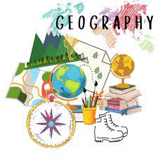

# GeoMaster

Brief Description:

GeoMaster AI is an innovative application designed to transform the learning experience of geography students and enthusiasts. 
By leveraging advanced language models from OpenAI and Google, the application provides detailed explanations, real-time data, and location based explanation. 
This makes learning geography more engaging and accessible. 
Key features include interactive Q&A, dynamic answers based on specific locations and categories, and real-time updates on various geographical events.

Target Audience:
Geography students,
Educators and tutors,
Geography enthusiasts,
Researchers

## Badges

Add badges from somewhere like: 

## Demo

1. Interactive Q&A:

Step 1: Open the GeoMaster AI application.

Step 2: Select "Interactive Q&A" from the sidebar.

Step 3: Type a geography-related question in the text input field.

Step 4: Click the "Get Answer" button.

Result: The application will provide a detailed answer to your question.

2. Dynamic Answer:

Step 1: Open the GeoMaster AI application.

Step 2: Select "Dynamic Answer" from the sidebar.

Step 3: Enter a location in the text input field.

Step 4: Select a category from the dropdown menu (e.g., Climate Zones, Population Density, Topography, Political Boundaries).

Step 5: Click the "Show Answer" button.

Result: The application will provide an answer related to the chosen location and category.

3. Real-Time Data:

Step 1: Open the GeoMaster AI application.

Step 2: Select "Real-Time Data" from the sidebar.

Step 3: Choose an event type from the dropdown menu (e.g., Natural Disasters, Climate Change, Weather Patterns, Seismic Activities, Ocean Currents).

Step 4: Click the "Get Data" button.

Result: The application will display the latest real-time data related to the selected event type.

## Features

Interactive Q&A

Dynamic Answer

Real-Time Data

## Acknowledgements

The development team behind GeoMaster AI acknowledges the significant contributions of various technologies and frameworks that made this project possible. 
I extend my gratitude to OpenAI for providing their powerful language model, which forms the backbone of my interactive Q&A and dynamic answer features.
I also thank Google Generative AI for offering robust tools that enhance the application's functionality.
Additionally, I appreciate the Streamlit framework for its user-friendly interface, enabling us to create an intuitive and seamless user experience. 
This project would not have been possible without the support and innovation of these cutting-edge technologies. 
Furthermore, I would like to express my sincere thanks to UNISEL for their unwavering support and to the trainers from AI Nusantara for their invaluable guidance and expertise.

